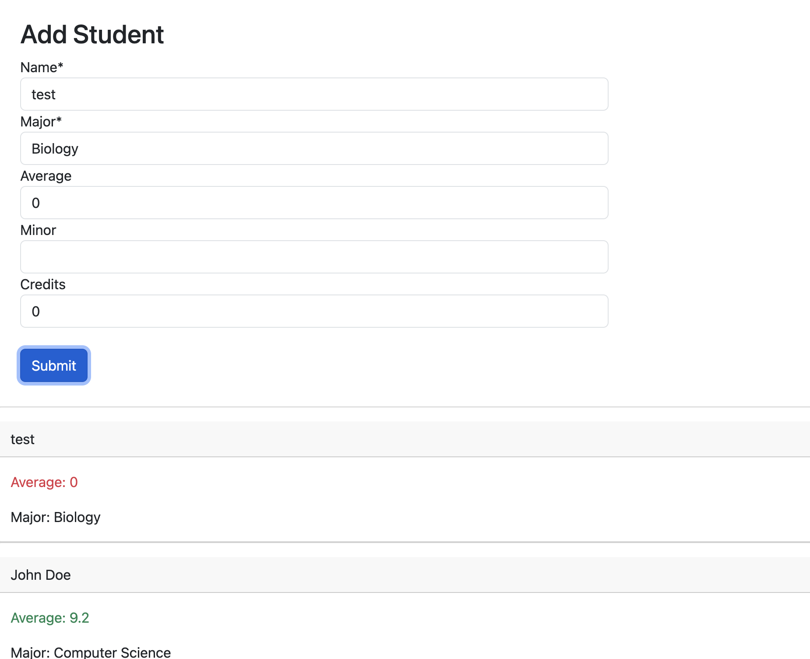

## List Alumnos




Una lista de alumnos dada una lista json.

## List Alumnos

- Promedio se marca en rojo si es menor a 8
- Promedio se marca en verde si es mayor a 8
- Minor no aparece si no existe
- Credits no aparece si no existe
- Se puede agregar nuevos estudiantes


## Deployment


```
ng build --configuration=production --base-href "https://nenewang.github.io/algo-page-angular/"
sudo npm install -g angular-cli-ghpages
ng add @angular-eslint/schematics@16
ngh --dir dist/lista-alumnos
ng deploy
```

Deployed at:

```
https://nenewang.github.io/lista-alumnos
```


